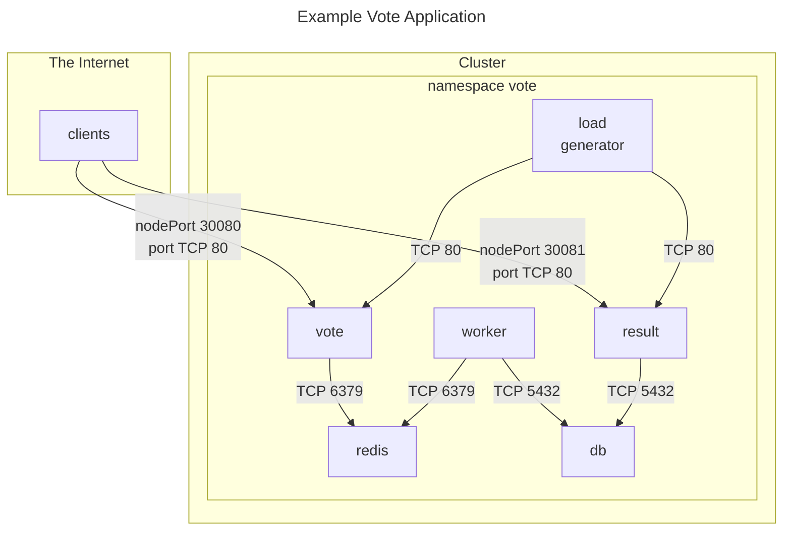
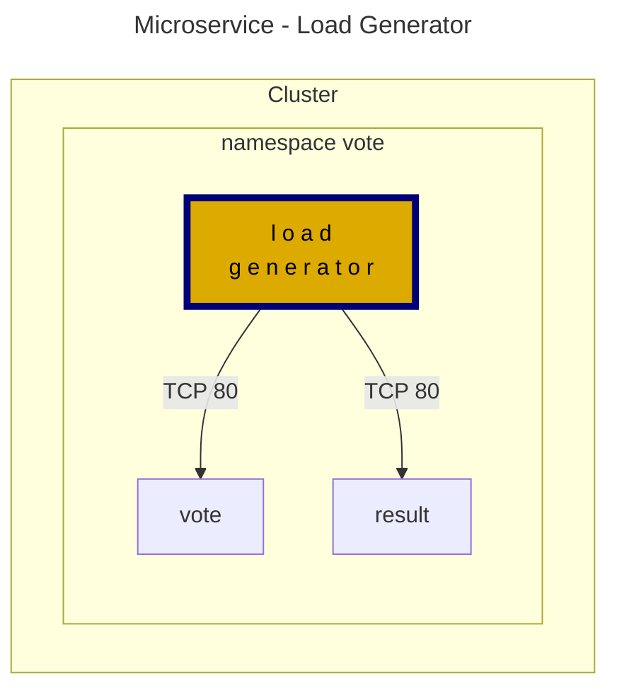
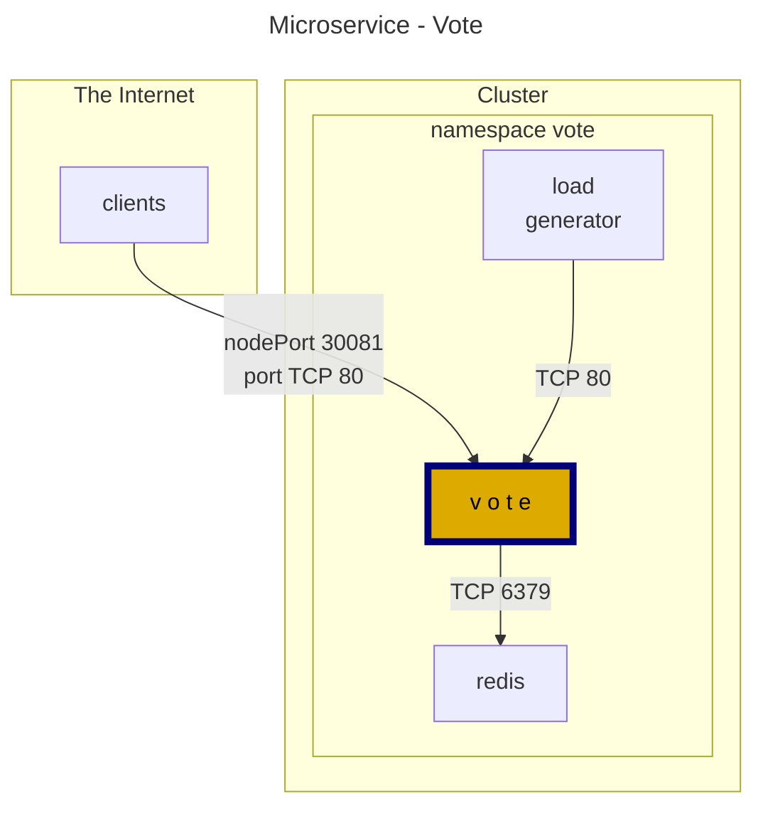
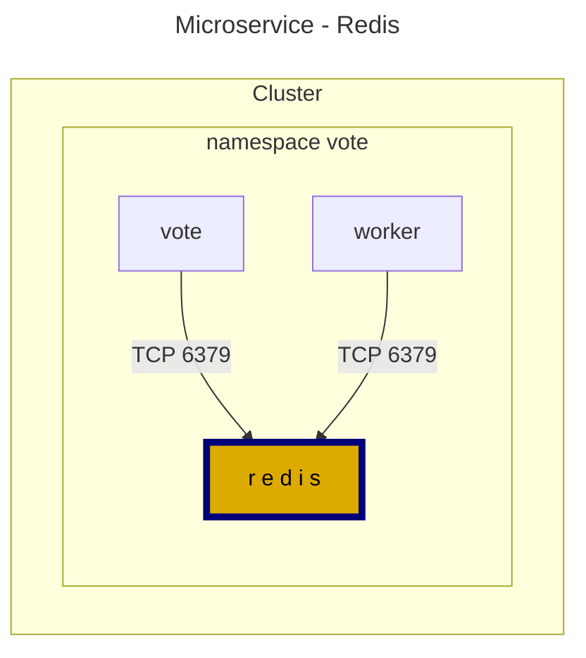
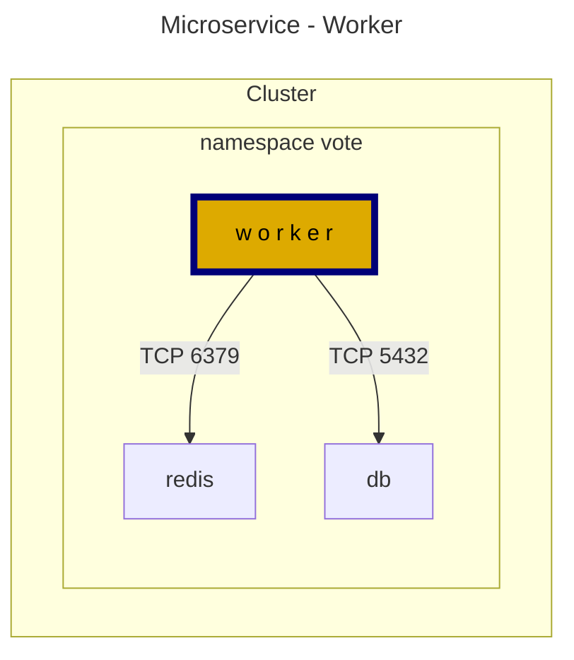
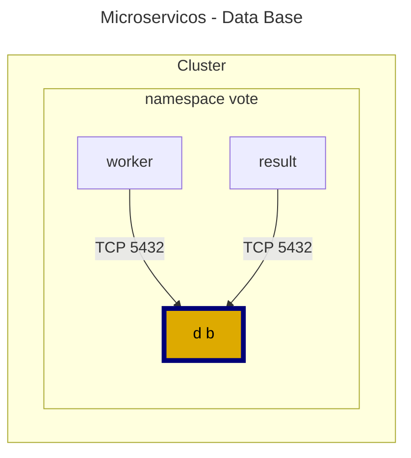
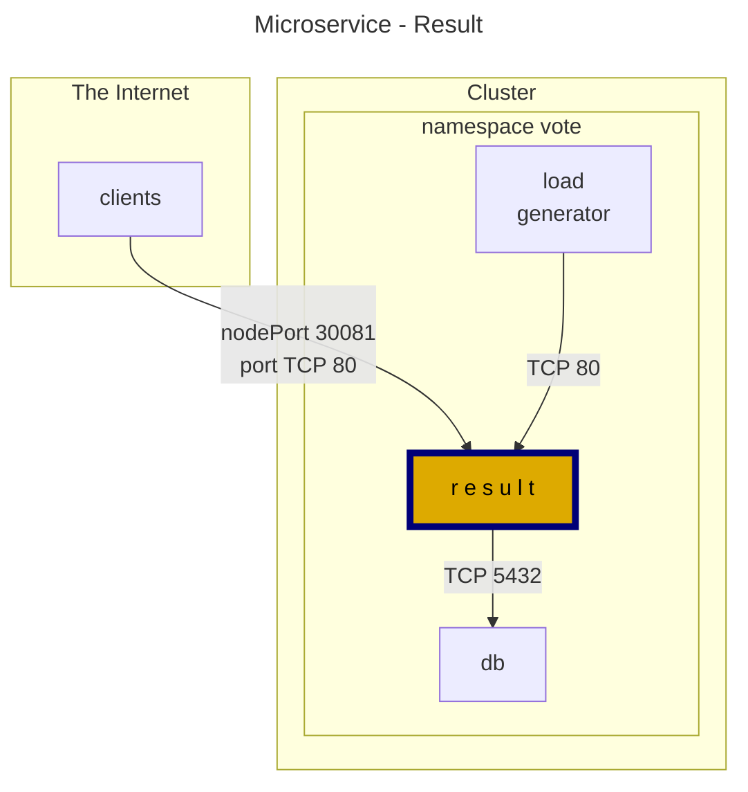

Initial project

Terraform

cat /var/log/cloud-init-output.log

---

Calico Installation

```bash
kubectl create -f https://raw.githubusercontent.com/projectcalico/calico/v3.26.0/manifests/tigera-operator.yaml
```

Calico configuration

```yaml
kubectl apply -f - <<-EOF
apiVersion: operator.tigera.io/v1
kind: Installation
metadata:
  name: default
spec:
  calicoNetwork:
    bgp: Disabled
    ipPools:
    - blockSize: 26
      cidr: 192.168.0.0/16
      encapsulation: VXLANCrossSubnet
      natOutgoing: Enabled
      nodeSelector: all()
---
apiVersion: operator.tigera.io/v1
kind: APIServer
metadata:
  name: default
spec: {}
EOF
```

---

Image scanner

```bash
git clone https://github.com/regisftm/website.git
```

---




Workloads

load generator



```yaml


```

vote



Redis



Worker



Data Base
 


Result



default-deny - vote ns
```yaml
kubectl apply -f - <<-EOF

EOF
```

default-deny - vote ns
```yaml
kubectl apply -f - <<-EOF
apiVersion: projectcalico.org/v3
kind: GlobalNetworkPolicy
metadata:
  name: default-deny
spec:
  selector: projectcalico.org/namespace == 'vote'
  types:
  - Ingress
  - Egress
EOF
```

vote app
```yaml
kubectl apply -f - <<-EOF
apiVersion: projectcalico.org/v3
kind: NetworkPolicy
metadata:
  name: vote
  namespace: vote
spec:
  selector: app == 'vote'
  types:
  - Ingress
  - Egress
  ingress:
  - action: Allow
    protocol: TCP
    source: {}
    destination:
      ports:
      - 80
  egress:
  - action: Allow
    protocol: TCP
    destination:
      selector: app == 'redis'
      ports:
      - 6379
EOF
```


allow-dns - vote ns
```yaml
kubectl apply -f - <<-EOF
apiVersion: projectcalico.org/v3
kind: GlobalNetworkPolicy
metadata:
  name: allow-kube-dns
spec:
  order: 10
  selector: all()
  namespaceSelector: projectcalico.org/name == 'vote'
  egress:
    - action: Allow
      protocol: UDP
      source: {}
      destination:
        selector: k8s-app == "kube-dns"
        ports:
          - '53'
  types:
    - Egress
EOF
```


redis - vote ns
```yaml
kubectl apply -f - <<-EOF
apiVersion: projectcalico.org/v3
kind: NetworkPolicy
metadata:
  name: redis
  namespace: vote
spec:
  selector: app == 'redis'
  types:
  - Ingress
  - Egress
  ingress:
  - action: Allow
    protocol: TCP
    source: 
      selector: app in {'vote', 'worker'}
    destination:
      ports:
      - 6379
EOF
```

worker - vote ns
```yaml
kubectl apply -f - <<-EOF
apiVersion: projectcalico.org/v3
kind: NetworkPolicy
metadata:
  name: worker
  namespace: vote
spec:
  selector: app == 'worker'
  types:
  - Ingress
  - Egress
  egress:
  - action: Allow
    protocol: TCP
    destination:
      selector: app == 'redis'
      ports:
      - 6379
  - action: Allow
    protocol: TCP
    destination:
      selector: app == 'db'
      ports:
      - 5432 
EOF
```


default-deny - vote ns
```yaml
kubectl apply -f - <<-EOF

EOF
```