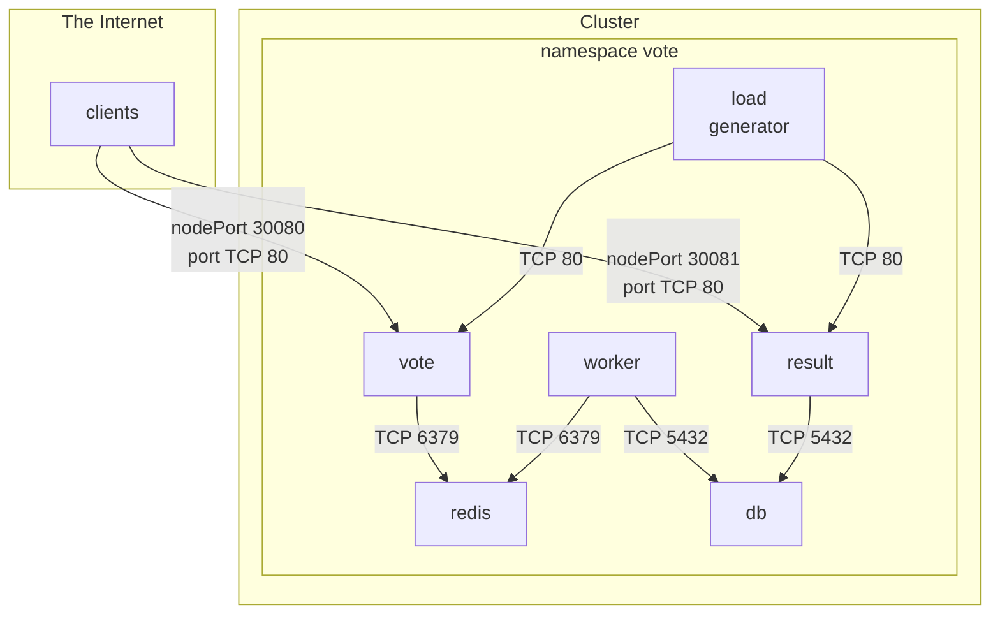
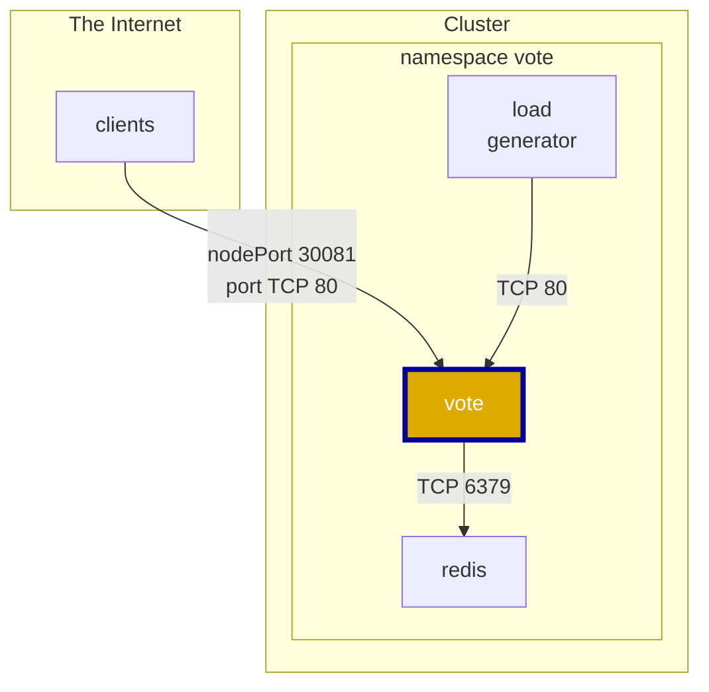

Initial project

Terraform

cat /var/log/cloud-init-output.log

---

Calico Installation

```bash
kubectl create -f https://raw.githubusercontent.com/projectcalico/calico/v3.26.0/manifests/tigera-operator.yaml
```

Calico configuration

```yaml
kubectl apply -f - <<-EOF
apiVersion: operator.tigera.io/v1
kind: Installation
metadata:
  name: default
spec:
  calicoNetwork:
    bgp: Disabled
    ipPools:
    - blockSize: 26
      cidr: 192.168.0.0/16
      encapsulation: VXLANCrossSubnet
      natOutgoing: Enabled
      nodeSelector: all()
---
apiVersion: operator.tigera.io/v1
kind: APIServer
metadata:
  name: default
spec: {}
EOF
```

---

Image scanner

```bash
git clone https://github.com/regisftm/website.git
```

---




Workloads

vote




