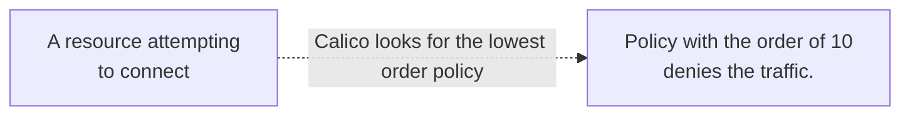
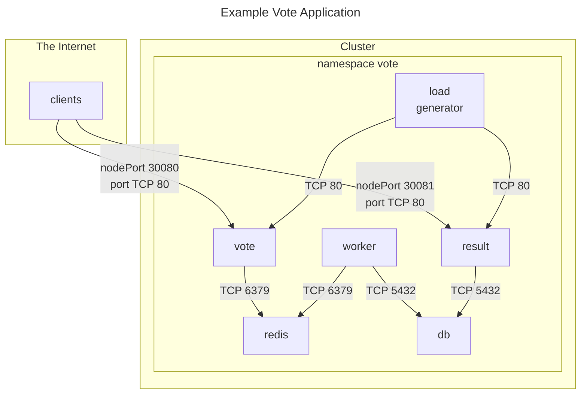
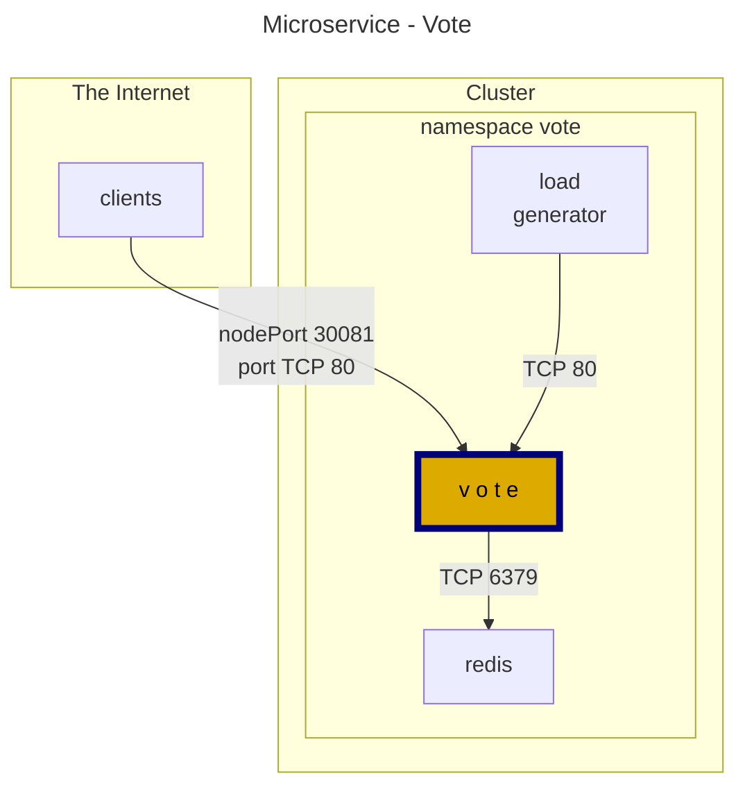
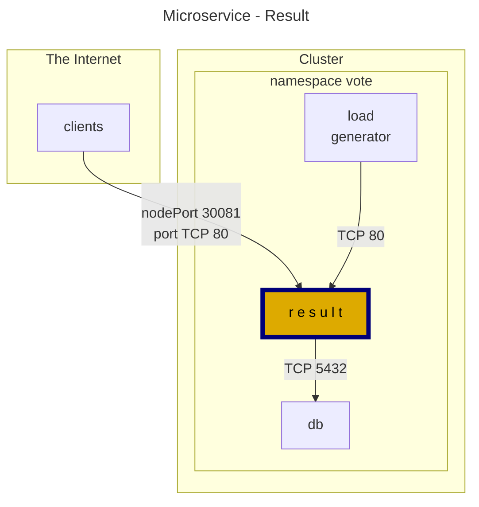
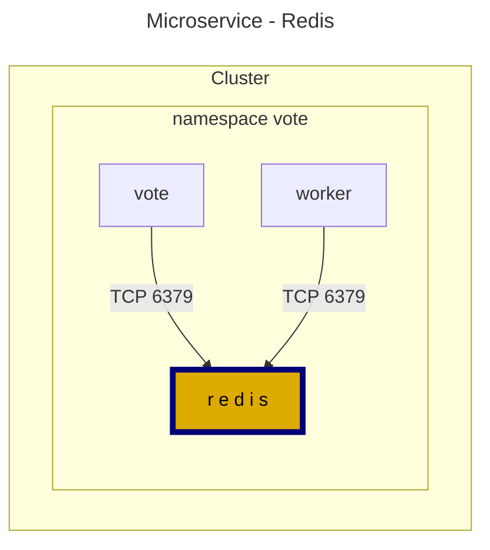
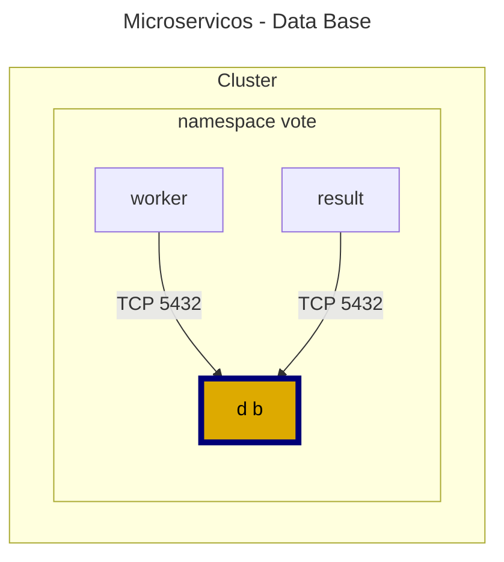
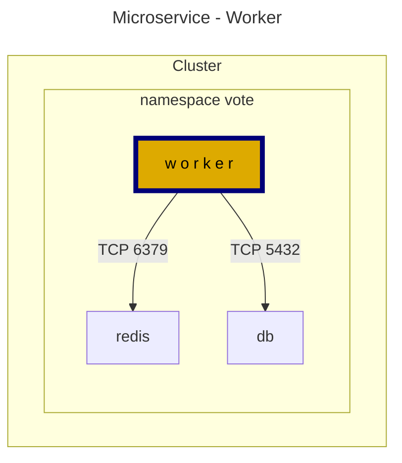
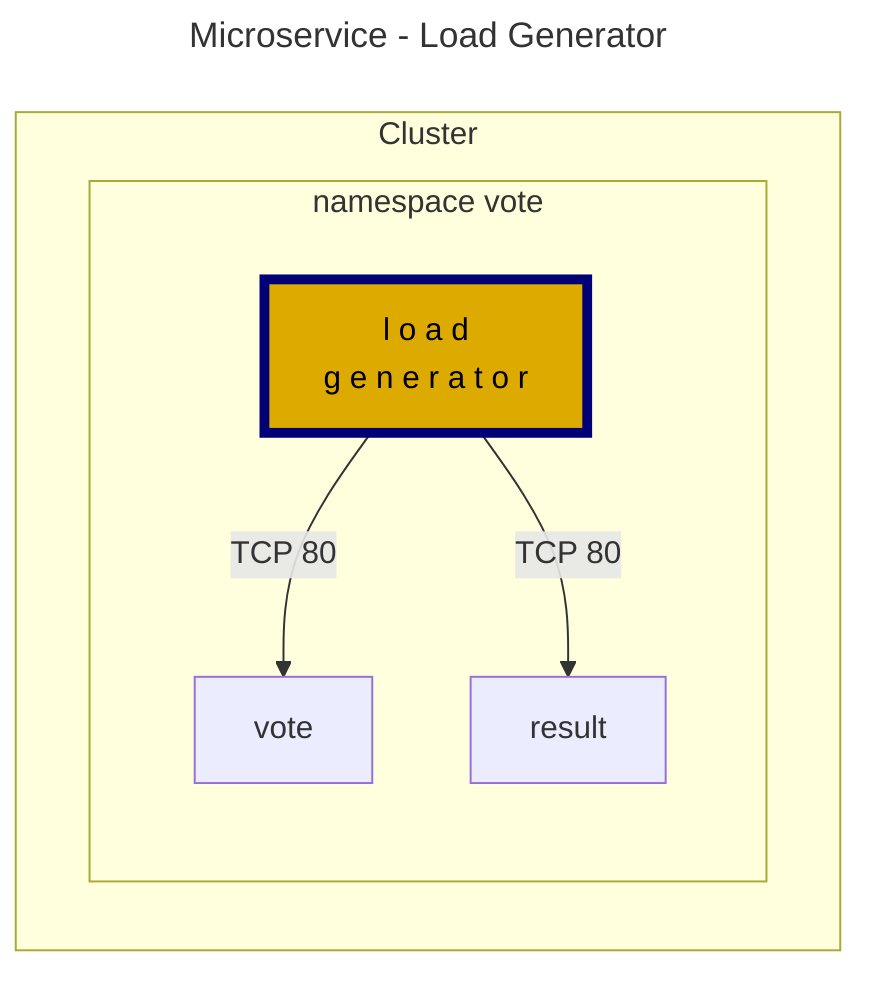

# 5 - Protect Your Application with **Security Policies**

## Security Policy design

Kubernetes provides a framework for defining and applying policies to your cluster; however, it is up to the administrator to create and enforce those policies. Yet, on its own, Kubernetes doesn't enforce these policies. It delegates this to the container networking interface (CNI) plugin. 

One of the default behaviours in Kubernetes is that all pods are allowed to communicate with each other. It means that if a pod runs a vulnerable application, other pods in the same cluster may also be at risk. To mitigate this risk, it is advisable to create network policies that restrict traffic between pods based on their labels. However, when you create a network policy, it changes the default behaviour to deny all traffic except what is explicitly allowed by the policy (with the assistance of your CNI). This implies that, if a pod attempts to communicate with another pod not explicitly permitted by the policy, the communication will be denied.

### Policy structure

<pre>
apiVersion: networking.k8s.io/v1
kind: NetworkPolicy
</pre>

<pre>
apiVersion: projectcalico.org/v3
kind: NetworkPolicy
</pre>

<pre>
apiVersion: projectcalico.org/v3
kind: GlobalNetworkPolicy
</pre>

### Rules
Each policy can contain one or more rules; these rules can affect traffics that are incoming `ingress` or outgoing `egress`.

An ingress rule example:

```yaml
apiVersion: projectcalico.org/v3
kind: NetworkPolicy
metadata:
  name: post-allow-list
  namespace: microblog
spec:
  selector: svc == 'post'
  types:
    - Ingress
  ingress:
    - action: Allow
      source:
        serviceAccounts:
          names: ['api', 'search']
        namespaceSelector: app == 'microblog'
      protocol: TCP
      destination:
        ports:
          - 8080
```

## Policy precedence

In Calico, policy priority is determined based on the order assigned to each policy, with lower-order policies taking precedence over higher-order policies. This means that if you have two policies in a Calico-enabled Kubernetes cluster, one that denies traffic with an order of 10 and the other that allows traffic with an order of 20, the traffic will be denied since the lower order policy takes precedence over the higher order policy.

The following illustration is the behavior that will take place in such a scenario:



In Calico, you can specify the order by adding the `order` field to the policy's `spec` section. For example:

```yaml
spec:
  order: 100
```

#### Kubernetes policy precedence
When you create a Kubernetes NetworkPolicy (KNP) and a Calico policy in the same cluster, Calico will automatically assign the KNP a default order number of `1000` since Kubernetes policy resources do not provide an explicit way to set the order of policy evaluation and enforcement.

Suppose you want the KNP to be evaluated and enforced before any Calico policies. In that case, you will need to set the order number of your Calico policy to a value higher than `1000`. For example, you can set the order number of your Calico policy to `1001` or higher to ensure that it is evaluated and enforced after the KNP.

> **Note:** It is essential to carefully manage policy order in Calico to ensure your policies are evaluated and enforced correctly in your Kubernetes cluster.


#### Calico un-ordered policies
You might now wonder what happens when a Calico policy is created with an undefined order number.
In such a case, Calico policies will automatically have an order number equal to infinity, and if you have two or more of these policies, the tie breaker rule will apply to determine their priority.

#### The tie breaker rule
In a scenario where you have multiple Calico policies without an order number or with the same order number, Calico policy engine will use their name as a tiebreaker to determine the order of policy evaluation and enforcement.

For example, if you have two unordered policies named `alpha` and `zulu`, the policy engine will first evaluate and enforce the policy named `alpha` and then the policy named `zulu`, or if you have two policies named `aac` and `aab` policy `aab` will be evaluated first. Keep in mind that 

#### The Log exception
Calico allows you to create iptable log rules to log packets that match specific criteria. These log rules can be assigned an order number like other policies, but it is important to note that the policy that comes after a log rule will be the final decider and no other policies will be evaluated. Therefore, you should ensure the policy after a log rule is configured correctly to avoid unintended consequences. 


#### Preventing a lockout
As a best practice, whenever you are trying to experiment with policies in any environment, it is best to implement a `safe-mode` strategy by first explicitly permitting the traffic and then writing your deny rules. This helps to eliminate the chance of accidentally locking yourself out of a cluster if a misconfigured policy is applied.

Use the following command to explicitly allow every traffic in and out of your cluster:

```yaml
kubectl create -f - <<-EOF
apiVersion: projectcalico.org/v3
kind: GlobalNetworkPolicy
metadata:
  name: final-allow-everything 
spec:
  order: 100001
  ingress:
  - action: Allow
  egress:
  - action: Allow
EOF
```

It is worth mentioning that Calico also implements a default fail-safe, a policy with a list of essential ports and services required for your cluster to function. Click [here](https://docs.tigera.io/calico/latest/network-policy/hosts/protect-hosts#failsafe-rules), if you like to know more about Calico's fail-safe.

--- 

# Protect an example application

As a practical example, let's install and protect the [**Example Voting Application**](https://github.com/dockersamples/example-voting-app). Below is a diagram explaining the port used for communication between the microservices.



Install the application by using the following command:

```bash
kubectl apply -f https://raw.githubusercontent.com/regisftm/owasp-toronto/main/vote-app/kubernetes-manifest.yaml
```

The services `vote` and `result` will expose the application to the internet. To access them, use the public IP address of the control-plane instance. The application will be exposed on the ports: `30080` for `vote` service and `30081` for the `result` service. Use HTTP protocol, as the applications are not secure.

`vote microservice`
```html
http://<contro_plane_public_ip>:30080  
```

`result microservice`
```html
http://<contro_plane_public_ip>:30081
```

> **Tip** : If you don't remember the control-plane public IP, get it from the metadata using the following command:
> ```bash
> curl http://169.254.169.254/latest/meta-data/public-ipv4
> ```

## The Zero Trust approach

By default, all traffic is allowed between the pods in a cluster. A global default deny policy ensures that unwanted traffic (ingress and egress) is denied by default. Pods without policy (or an incorrect policy) are not allowed traffic until the appropriate network policy is defined. A global deny policy helps mitigate lateral malicious attacks.

We recommend creating a global default deny policy after you complete writing policies for the traffic you want to allow. For this exercise, as we are targeting the vote namespace only, let's apply the default-deny first and break the application. After, let's create all the needed policies, using the principle of least privilege, granting access only to what is required, to have our application working again.

`default-deny - vote ns`
```yaml
kubectl apply -f - <<-EOF
apiVersion: projectcalico.org/v3
kind: GlobalNetworkPolicy
metadata:
  name: default-deny
spec:
  order: 10000
  selector: projectcalico.org/namespace == 'vote'
  types:
  - Ingress
  - Egress
EOF
```

Note that, despite the applied policy being a `GlobalNetworkPolicy`, we are restricting its action to the `vote` namespace using the `selector: projectcalico.org/namespace == 'vote'`. In this way, the traffic from and to any pod running inside the namespace `vote` will be denied.

**Reload the `vote` and `result` applications on your browser. You should see a `ERR_CONNECTION_TIMED_OUT` message.**

### Allowing network connections

Access to DNS is essential for pods in a Kubernetes cluster because it enables service discovery, load balancing, and communication between pods using domain names. DNS allows pods to resolve domain names to IP addresses, facilitating seamless connectivity within the cluster and connectivity with external resources.

Instead of creating a rule inside each security policy of each microservice, we will use the `GlobalNetworkPolicy` to give all pod access to the DNS service. This will help us avoid repeating ourselves by writing the same rule on each policy.

`allow-dns - vote ns`
```yaml
kubectl apply -f - <<-EOF
apiVersion: projectcalico.org/v3
kind: GlobalNetworkPolicy
metadata:
  name: allow-kube-dns
spec:
  order: 10
  selector: all()
  namespaceSelector: projectcalico.org/name == 'vote'
  egress:
    - action: Allow
      protocol: UDP
      source: {}
      destination:
        selector: k8s-app == "kube-dns"
        ports:
          - '53'
  types:
    - Egress
EOF
```

Now let's create the policies for the microservices. For this, we need to understand how they interact with each other. 

For each microservice, there is a diagram showing the other microservices that connects to it or that it connects to and the ports used. After the graph, you can find the security policy to be applied. Go over each microservice, apply the policies and observe the results on the application interface on the web.

#### vote microservice



`vote microservice security policy`
```yaml
kubectl apply -f - <<-EOF
apiVersion: projectcalico.org/v3
kind: NetworkPolicy
metadata:
  name: vote
  namespace: vote
spec:
  selector: app == 'vote'
  types:
  - Ingress
  - Egress
  ingress:
  - action: Allow
    protocol: TCP
    source: {}
    destination:
      ports:
      - 80
  egress:
  - action: Allow
    protocol: TCP
    destination:
      selector: app == 'redis'
      ports:
      - 6379
EOF
```

Apply the policy and try to connect to the vote application again from your browser. What changed? Can you vote?

#### result microservice



`result microservice security policy`
```yaml
kubectl apply -f - <<-EOF
apiVersion: projectcalico.org/v3
kind: NetworkPolicy
metadata:
  name: result
  namespace: vote
spec:
  selector: app == 'result'
  types:
  - Ingress
  - Egress
  ingress:
  - action: Allow
    protocol: TCP
    source: {}
    destination:
      ports:
      - 80
  egress:
  - action: Allow
    protocol: TCP
    destination:
      selector: app == 'db'
      ports:
      - 5432
EOF
```

Try to connect to the result application again from your browser. What changed?

#### redis microservice



`redis microservice security policy`
```yaml
kubectl apply -f - <<-EOF
apiVersion: projectcalico.org/v3
kind: NetworkPolicy
metadata:
  name: redis
  namespace: vote
spec:
  selector: app == 'redis'
  types:
  - Ingress
  - Egress
  ingress:
  - action: Allow
    protocol: TCP
    source: 
      selector: app in {'vote', 'worker'}
    destination:
      ports:
      - 6379
EOF
```

Apply the policy and try to connect to the `vote` application again from your browser. What changed? Can you vote now?


#### db microservice

Data Base
 


`db microservice security policy`
```yaml
kubectl apply -f - <<-EOF
apiVersion: projectcalico.org/v3
kind: NetworkPolicy
metadata:
  name: db
  namespace: vote
spec:
  selector: app == 'db'
  types:
  - Ingress
  - Egress
  ingress:
  - action: Allow
    protocol: TCP
    source: 
      selector: app in {'worker', 'result'}
    destination:
      ports:
      - 5432
EOF
```

Apply the policy and try to connect to the `result` application again from your browser. What changed?

#### worker microservice



`worker microservice security policy`
```yaml
kubectl apply -f - <<-EOF
apiVersion: projectcalico.org/v3
kind: NetworkPolicy
metadata:
  name: worker
  namespace: vote
spec:
  selector: app == 'worker'
  types:
  - Ingress
  - Egress
  egress:
  - action: Allow
    protocol: TCP
    destination:
      selector: app == 'redis'
      ports:
      - 6379
  - action: Allow
    protocol: TCP
    destination:
      selector: app == 'db'
      ports:
      - 5432 
EOF
```

Apply the policy and connect to the `result` application again from your browser. What changed?

#### loadgenerator service



Before applying the policy, note that the number of votes is not changing in the `result` interface.

`worker microservice security policy`
```yaml
kubectl apply -f - <<-EOF
apiVersion: projectcalico.org/v3
kind: NetworkPolicy
metadata:
  name: loadgenerator
  namespace: vote
spec:
  selector: app == 'loadgenerator'
  types:
  - Ingress
  - Egress
  egress:
  - action: Allow
    protocol: TCP
    destination:
      selector: app in {'vote', 'result'}
      ports:
      - 80
EOF
```

Apply the policy and connect to the `result` application again from your browser. Is the number of votes changing every 5 seconds?

### **Congratulations! You have your application protected agains external and internal network attacks!**

---

[:arrow_right: 6 - Calico Components Metrics](/demo/06-calico-metrics.md) <br>

[:arrow_left: 4 - Scan Images for Vulnerabilities with **tigera-scanner**](/demo/04-tigera-scanner.md)  
[:leftwards_arrow_with_hook: Back to Main](/README.md)  